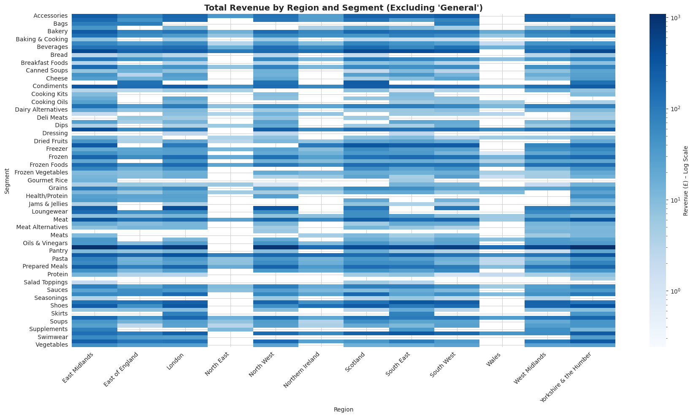

# RDAMP-Sales-Analysis

🛍️ Ace Superstore Retail Data Analysis

## Overview

This project presents a comprehensive analysis of Ace Superstore’s sales data using Python. The goal is to extract actionable insights across product segments, regions, and order channels while meeting defined business criteria. The analysis includes sales distribution, profitability, revenue patterns, and performance benchmarking.

---

## ✅ Acceptance Criteria & Approach

### 1. Data Quality Assessment

- **Missing Values**: Detected and dropped rows with missing `Sales`, `Cost Price`, `Discount`, `Category`, and `Sub-Category`.
- **Data Types**: Converted `Sales`, `Cost Price`, and `Discount` columns to numeric using `pd.to_numeric()`.
- **Anomalies**: Verified no negative values in cost or sales after cleaning.
- **Duplicates**: Checked using `duplicated()` – none found or dropped as needed.

---

### 2. Total Sales, Revenue, and Discount Rates by Region & Segment

- Used pivot tables to summarize:
  - **Total Sales**
  - **Revenue** (assumed to align with total sales post-discount)
  - **Average Discount Rates**
- Heatmaps with logarithmic color scales were used to highlight regional/segment trends.

📊 **Visuals**:

---

### 3. Best and Worst Performing Products by Revenue

- **Top 5 Best-Selling Products** by total revenue were identified using `groupby('Product')['Sales'].sum().nlargest(5)`.
- **Bottom 5** by the same metric also extracted.

📊 **Visuals**:

---

### 4. Profit Margin Insights by Category

- Calculated **Profit** per transaction as:  
  `Profit = Sales - Cost Price - Discount`
- Computed **Average Profit** by:
  - `Sub-Category` – for granular performance
  - `Category` – for broader business units
- Also computed **Profit Margin**: `Profit / Sales`

📊 **Visuals**:

---

### 5. Sales Distribution: Online vs In-Store

- Aggregated sales by `Order Mode`:
  - Online: £155,587 (≈ 51.63%)
  - In-Store: £145,747 (≈ 48.37%)

📊 **Visual**:  

---

### 6. Tools Used

- 🐍 **Python 3 (Google Colab)**
- 📦 **Pandas**: Data cleaning, aggregation, and summaries
- 📊 **Seaborn & Matplotlib**: Visualisations
- 📁 **CSV** dataset input (Ace Superstore Retail Dataset)

---

### 7. Key Insights

All findings are clearly documented with charts and commentary. Key insights can be seen below:

Based on the exploratory analysis, the following business-relevant insights were identified:
	•	**Online vs In-Store**:
Online orders slightly surpassed in-store performance, contributing 51.63% of sales. This suggests that online channels are equally, if not more, important than physical stores for this retailer.
	•	**Top-Selling Segments**:
The highest grossing segments were Vegetables, Pantry, and Health/Protein, showing strong demand for fresh produce, everyday essentials, and wellness-focused items.
	• **Underperforming Segments**:
Sub-categories like Cooking Kits, Gourmet Rice, and Loungewear had the lowest revenue and poor margins, indicating possible misalignment with customer preferences.
	•	**Profitability vs Volume**:
	•	Some high-revenue segments (e.g., Vegetables) had low margins, meaning they rely heavily on sales volume rather than per-unit profitability.
	•	Others (e.g., Supplements, Shoes, Cheese) achieved high average profit despite lower sales volumes.
	•	**Discounting Strategy**:
Heavy discounting (especially in Deli Meats, Dips, etc.) correlated with lower profit margins. Discount optimization may help improve net gains without losing volume.
	•	**Regional Trends**:
Sales and discount behaviour varied across regions. For instance, London and Yorkshire & the Humber showed high revenues, but some regions paired high discounts with underperformance, indicating room for improvement in local marketing.
